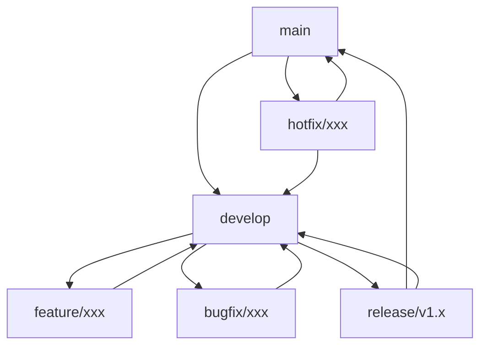

# CodeWave 版本控制规范

## 1. 版本号规范

### 1.1 语义化版本
遵循 [Semantic Versioning 2.0.0](https://semver.org/) 规范：
- 主版本号：不兼容的 API 修改
- 次版本号：向下兼容的功能性新增
- 修订号：向下兼容的问题修正

示例：`v1.2.3`
- 1 = 主版本号
- 2 = 次版本号
- 3 = 修订号

### 1.2 版本发布规则
- Alpha版本：`v1.2.3-alpha.1`
- Beta版本：`v1.2.3-beta.1`
- RC版本：`v1.2.3-rc.1`
- 正式版本：`v1.2.3`

## 2. 分支管理

### 2.1 分支策略
```
分支类型：
1. 主分支
   - main：产品发布分支
   - develop：开发主分支

2. 特性分支
   - feature/*：新功能开发
   - bugfix/*：问题修复
   - hotfix/*：紧急修复
   - release/*：版本发布
```

### 2.2 工作流程


### 2.3 分支命名规范
```
feature/[功能描述]
例如：feature/user-auth

bugfix/[问题描述]
例如：bugfix/login-error

hotfix/[紧急问题]
例如：hotfix/security-fix

release/[版本号]
例如：release/v1.2.0
```

## 3. 提交规范

### 3.1 提交格式
```
<type>(<scope>): <subject>

<body>

<footer>
```

### 3.2 类型说明
```
feat: 新功能
fix: 修复问题
docs: 文档更新
style: 代码格式
refactor: 代码重构
test: 测试相关
chore: 构建过程
```

### 3.3 范围说明
```
core: 核心功能
ui: 界面相关
api: 接口相关
plugin: 插件相关
docs: 文档相关
```

## 4. 发布流程

### 4.1 版本发布流程
```
1. 创建发布分支
   git checkout -b release/v1.2.0 develop

2. 版本准备
   - 更新版本号
   - 更新文档
   - 执行测试

3. 合并到主分支
   git checkout main
   git merge release/v1.2.0

4. 打标签
   git tag -a v1.2.0 -m "version 1.2.0"

5. 合并回开发分支
   git checkout develop
   git merge release/v1.2.0
```

### 4.2 发布检查清单
```
□ 版本号更新
□ 更新日志完善
□ 文档更新
□ 测试通过
□ 性能测试
□ 安全检查
□ 依赖更新
□ 构建验证
```

## 5. 代码评审

### 5.1 评审重点
```
1. 代码质量
   - 代码规范
   - 性能影响
   - 安全问题

2. 功能完整
   - 需求覆盖
   - 边界处理
   - 错误处理

3. 测试覆盖
   - 单元测试
   - 集成测试
   - 性能测试
```

### 5.2 评审流程
```
1. 提交PR
   - 描述清晰
   - 范围适中
   - 包含测试

2. 评审过程
   - 代码审查
   - 测试验证
   - 性能检查

3. 合并确认
   - 解决评论
   - 确认测试
   - 批准合并
```
